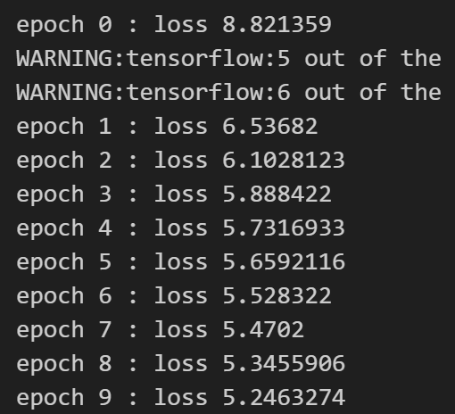

**诗歌生成实验报告**

## 1. RNN、LSTM 和 GRU 模型介绍

### 1.1 RNN（循环神经网络）
循环神经网络（Recurrent Neural Network, RNN）是一种适用于序列数据的神经网络。与传统的前馈神经网络不同，RNN 具有内部状态（隐藏状态），可以捕捉输入序列中的时间依赖性。

RNN 的主要特点：
- 具有循环结构，使得前一个时刻的信息可以影响当前时刻的计算。
- 适用于自然语言处理（NLP）、时间序列预测等任务。
- 由于梯度消失和梯度爆炸问题，普通 RNN 在处理长序列时效果较差。

RNN 计算公式如下：
$h_t = f(W_h h_{t-1} + W_x x_t + b)$
其中：
- $h_t$ 是当前时刻的隐藏状态
- $x_t$ 是输入
- $W_h, W_x, b$ 是可训练参数
- $f$ 通常是 $\tanh$ 或 ReLU 激活函数

### 1.2 LSTM（长短时记忆网络）
LSTM（Long Short-Term Memory）是 RNN 的改进版本，专门用于解决梯度消失问题。LSTM 通过引入门控机制（输入门、遗忘门、输出门）来控制信息的流动，使得网络可以学习长距离的依赖关系。

LSTM 结构包含：
- **输入门（Input Gate）**：决定新信息是否加入细胞状态。
- **遗忘门（Forget Gate）**：决定哪些信息需要遗忘。
- **输出门（Output Gate）**：决定当前隐藏状态的输出。

LSTM 的核心计算：
$f_t = \sigma(W_f [h_{t-1}, x_t] + b_f)$
$i_t = \sigma(W_i [h_{t-1}, x_t] + b_i)$
$\tilde{C_t} = \tanh(W_C [h_{t-1}, x_t] + b_C)$
$C_t = f_t * C_{t-1} + i_t * \tilde{C_t}$
$o_t = \sigma(W_o [h_{t-1}, x_t] + b_o)$
$h_t = o_t * \tanh(C_t)$

### 1.3 GRU（门控循环单元）
GRU（Gated Recurrent Unit）是 LSTM 的简化版本，合并了输入门和遗忘门，使得计算更加高效。

GRU 的核心计算：
$r_t = \sigma(W_r [h_{t-1}, x_t] + b_r)$  (重置门)
$z_t = \sigma(W_z [h_{t-1}, x_t] + b_z)$  (更新门)
$\tilde{h_t} = \tanh(W_h [r_t * h_{t-1}, x_t] + b_h)$
$h_t = (1 - z_t) * h_{t-1} + z_t * \tilde{h_t}$

GRU 计算成本比 LSTM 低，但效果接近。

---

## 2. 诗歌生成过程

### 2.1 数据预处理
- 读取诗歌文本数据。
- 处理文本，转换为字符序列，并为每个字符分配唯一的索引（word2id）。
- 生成训练数据集。

### 2.2 模型构建
- 使用 TensorFlow/Keras 构建一个基于 LSTM/GRU 的神经网络。
- 模型输入是字符序列，输出是下一个字符的概率分布。
- 采用交叉熵损失函数进行优化。

### 2.3 训练过程
- 采用 Adam 优化器。
- 训练过程中，每次取一个批次的数据进行前向传播和反向传播。
- 训练过程中，每 500 步打印一次损失。

### 2.4 生成诗歌
- 选择一个开始词，如“日”、“红”、“山”、“夜”、“湖”、“海”、“月”等。
- 通过训练好的 RNN 模型逐步生成后续字符。
- 生成完成后，拼接成完整的诗句。

---

## 3. 试验结果

### 3.1 训练
训练过程中，随着 epoch 增加，损失逐渐降低，说明模型在学习数据分布。

### 3.2 生成的诗歌

## 4. 试验总结

本次实验通过 RNN 结构实现了基于深度学习的诗歌生成，主要结论如下：
- **LSTM 和 GRU 结构** 适用于处理长序列文本，并能较好地学习文本模式。
- **训练过程收敛**，损失下降，表明模型能够有效学习诗歌结构。
- **生成的诗歌** 具有一定的语言风格，但仍存在局部不连贯的问题。
- **改进方向**：
  - 增加训练数据，提高模型泛化能力。
  - 采用 Transformer 等更先进的 NLP 模型。
  - 结合注意力机制，使生成的文本更加流畅。

通过本实验，我们加深了对 RNN、LSTM、GRU 的理解，并探索了深度学习在文本生成任务中的应用。

